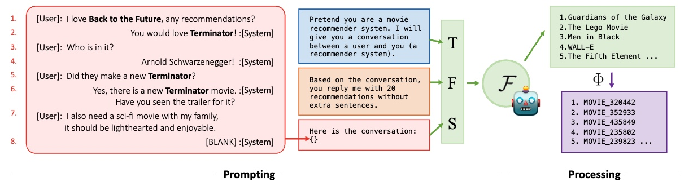

# Large Language Models as Zero-Shot Conversational Recommenders



This is the evaluation data and Large Language Models (LLMs) results from our CIKM'23 paper:

**Large Language Models as Zero-Shot Conversational Recommenders**, Zhankui He*, Zhouhang Xie*, Rahul Jha, Harald Steck, Dawen Liang, Yesu Feng, Bodhisattwa Majumder, Nathan Kallus, Julian McAuley, Conference on Information and Knowledge Management, CIKM'23. * denotes equal contribution.

Please check the [arxiv version](https://arxiv.org/pdf/2308.10053.pdf) of this paper, where we will update more detailed information than the CIKM'23 version. **This is a work from UCSD-Netflix collaboration.**

Please contact [Zhankui He](https://aaronheee.github.io) if you have any questions, thanks!

## Dataset

### Disclaimer

⚠️ **Please note that conversations processed from Reddit raw data may include content that is not entirely conducive to a positive experience (e.g., toxic speech). Exercise caution and discretion when utilizing this information.**

### Testing Data for Our Paper

We uploaded the test data in `data/` folder, which can be used to form the prompt to query different LLMs. The `inspired` and `redial` datasets are adapted from the data provided by [`CRSLab`](https://github.com/RUCAIBox/CRSLab/tree/main), where we added some additional data fields like `is_user`.

| File Name | Description | Example |
| -- | -- | -- |
|  `entity2id.json`  |  The mapping from the movie names (in `DBPedia` or `IMDB` format) to item ids. |  `{"<http://dbpedia.org/resource/Hoffa_(film)>": 0}`  |
|  `item_ids.json`  | A list of all the item ids.   |  `[0, 2049, 16388, 12292, 6, 4109, ...]` |
|  `test.json`  |  Conversational context (in `input` field) and target recommendation item (in `rec` field)  |  `{"input": "System: How did you like Hustlers? It definitely has the drama aspect...\n User: I liked it ..." "rec": [9722]}`  |
|  `test_p2.json`  |  Similar to `test.json`, but we use historical mentioned movies only. P2 stands for **"Placeholder 2"**  |  `{"input": "System: Hustlers\n User:" "rec": [9722]}`  |
|  `test_p3.json`  |  Similar to `test.json`, but we use historical conversational text without mentioned movies. P3 stands for **"Placeholder 3"**  |  `{"input": "System: How did you like ? It definitely has the drama aspect...\n User: I liked it ..." "rec": [9722]}`  |
|  `test_p4.json`  |  Similar to `test.json`, but we use historical conversational text with randomly mentioned movies. P4 stands for **"Placeholder 4"**  |  `{"input": "System: How did you like Titanic? It definitely has the drama aspect...\n User: I liked it ..." "rec": [9722]}`  |
|  `test_raw.json`  |  Raw data file similar to the files provided in [`CRSLab`](https://github.com/RUCAIBox/CRSLab/tree/main)  |  `{"context": ["", ... "the last movie i saw in the theater was Hustlers . I generally like comedy, drama and documentaries"], "resp": "How did you like Hustlers? ...", "rec": [9722], "entity": [9722, 15748], "prev_entity": [15748, 17158, 8683, 8881, 16785, 9722], "dialog_id": "test_0", "turn_id": "test_4", "is_user": 0, "entity_name": ["drama", "Hustlers"]}`  |

We provide the training, validation and testing data of these three datasets in huggingface datasets hub, please check [`inspired_cikm`](https://huggingface.co/datasets/ZhankuiHe/inspired_cikm), [`redial_cikm`](https://huggingface.co/datasets/ZhankuiHe/redial_cikm) and [`reddit_cikm`](https://huggingface.co/datasets/ZhankuiHe/reddit_cikm).

### Complete Version `Reddit-Movie` Dataset

We upload the raw (`Reddit-Movie-raw`) and processed data of one-year (`Reddit-Movie-small-V1`) and ten-year (`Reddit-Movie-large-V1`) conversational recommendation in movie domain from [Reddit](https://www.reddit.com/) to [huggingface datasets hub](https://huggingface.co/datasets). This dataset is processed from the reddit dump on [pushshift.io](https://pushshift.io) and only for research use.

| Data Name | Data Size | Time Range | 
| -- | -- | -- |
| [`Reddit-Movie-raw`](https://huggingface.co/datasets/ZhankuiHe/reddit_movie_raw) | 2.81GB | January 2012 - December 2022 |
| [`Reddit-Movie-small-V1`](https://huggingface.co/datasets/ZhankuiHe/reddit_movie_small_v1) | 510MB | January 2022 - December 2022 |
| [`Reddit-Movie-large-V1`](https://huggingface.co/datasets/ZhankuiHe/reddit_movie_large_v1) | 2.35GB | January 2012 - December 2022 |

**NOTE:** Different from the previous conversational recommendation datasets from crowdsourcing, our `Reddit-Movie` dataset is constructed by mining web data. Therefore, it is noisy and needs efforts for data cleaning such as *named entity recognition* and *entity linking*. Thus we use `V1` to highlight that this processed version is the first verion. **Welcome to contribute to cleaner processed versions (such as `V2`) in the future!**

## LLMs Results

### Generated Results

Here `text` means the file of generated text and extracted predicted movies; `r*` denotes the results with different post-processing as below:

| Result Type | OOV Items Filtered ? | Seen Items Filtered ? | 
| -- | -- | -- |
| `r1` | ❌ | ❌ | 
| `r2` | ❌ | ✅ | 
| `r3` | ✅ | ❌ | 
| `r4` | ✅ | ✅ | 

"OOV Items" means the out-of-vocabulary items, i.e., the items that are not legal in the pre-defined candidate set. We can filter the generated OOV items out or not. Also, "Seen Items" means the items mentioned in the current conversation already, which is related to the **"Repeated Items Can Be Shortcuts"** finding in our paper.

We provide the results on `inspired`, `redial` and `reddit` datasets:

| LLMs on `inspired` | General | Placeholder 2 | Placeholder 3 | Placeholder 4 | 
| -- | -- | -- | -- | -- |
| [`GPT-4`](https://platform.openai.com/docs/models/gpt-4) | [text](./src/gpt-4/general/intermediate/inspired/extracted.jsonl), [r1](./src/gpt-4/general/intermediate/inspired/filtered_False_exclude_seen_False/summary.csv), [r2](./src/gpt-4/general/intermediate/inspired/filtered_False_exclude_seen_True/summary.csv), [r3](./src/gpt-4/general/intermediate/inspired/filtered_True_exclude_seen_False/summary.csv), [r4](./src/gpt-4/general/intermediate/inspired/filtered_True_exclude_seen_True/summary.csv) | [text](./src/gpt-4/p2/intermediate/inspired/extracted.jsonl), [r1](./src/gpt-4/p2/intermediate/inspired/filtered_False_exclude_seen_False/summary.csv), [r2](./src/gpt-4/p2/intermediate/inspired/filtered_False_exclude_seen_True/summary.csv), [r3](./src/gpt-4/p2/intermediate/inspired/filtered_True_exclude_seen_False/summary.csv), [r4](./src/gpt-4/p2/intermediate/inspired/filtered_True_exclude_seen_True/summary.csv) | [text](./src/gpt-4/p3/intermediate/inspired/extracted.jsonl), [r1](./src/gpt-4/p3/intermediate/inspired/filtered_False_exclude_seen_False/summary.csv), [r2](./src/gpt-4/p3/intermediate/inspired/filtered_False_exclude_seen_True/summary.csv), [r3](./src/gpt-4/p3/intermediate/inspired/filtered_True_exclude_seen_False/summary.csv), [r4](./src/gpt-4/p3/intermediate/inspired/filtered_True_exclude_seen_True/summary.csv) | [text](./src/gpt-4/p4/intermediate/inspired/extracted.jsonl), [r1](./src/gpt-4/p4/intermediate/inspired/filtered_False_exclude_seen_False/summary.csv), [r2](./src/gpt-4/p4/intermediate/inspired/filtered_False_exclude_seen_True/summary.csv), [r3](./src/gpt-4/p4/intermediate/inspired/filtered_True_exclude_seen_False/summary.csv), [r4](./src/gpt-4/p4/intermediate/inspired/filtered_True_exclude_seen_True/summary.csv) |
| [`GPT-3.5-turbo`](https://platform.openai.com/docs/models/gpt-3-5) | [text](./src/gpt-3.5-turbo/general/intermediate/inspired/extracted.jsonl), [r1](./src/gpt-3.5-turbo/general/intermediate/inspired/filtered_False_exclude_seen_False/summary.csv), [r2](./src/gpt-3.5-turbo/general/intermediate/inspired/filtered_False_exclude_seen_True/summary.csv), [r3](./src/gpt-3.5-turbo/general/intermediate/inspired/filtered_True_exclude_seen_False/summary.csv), [r4](./src/gpt-3.5-turbo/general/intermediate/inspired/filtered_True_exclude_seen_True/summary.csv) | [text](./src/gpt-3.5-turbo/p2/intermediate/inspired/extracted.jsonl), [r1](./src/gpt-3.5-turbo/p2/intermediate/inspired/filtered_False_exclude_seen_False/summary.csv), [r2](./src/gpt-3.5-turbo/p2/intermediate/inspired/filtered_False_exclude_seen_True/summary.csv), [r3](./src/gpt-3.5-turbo/p2/intermediate/inspired/filtered_True_exclude_seen_False/summary.csv), [r4](./src/gpt-3.5-turbo/p2/intermediate/inspired/filtered_True_exclude_seen_True/summary.csv) | [text](./src/gpt-3.5-turbo/p3/intermediate/inspired/extracted.jsonl), [r1](./src/gpt-3.5-turbo/p3/intermediate/inspired/filtered_False_exclude_seen_False/summary.csv), [r2](./src/gpt-3.5-turbo/p3/intermediate/inspired/filtered_False_exclude_seen_True/summary.csv), [r3](./src/gpt-3.5-turbo/p3/intermediate/inspired/filtered_True_exclude_seen_False/summary.csv), [r4](./src/gpt-3.5-turbo/p3/intermediate/inspired/filtered_True_exclude_seen_True/summary.csv) | [text](./src/gpt-3.5-turbo/p4/intermediate/inspired/extracted.jsonl), [r1](./src/gpt-3.5-turbo/p3/intermediate/inspired/filtered_False_exclude_seen_False/summary.csv), [r2](./src/gpt-3.5-turbo/p4/intermediate/inspired/filtered_False_exclude_seen_True/summary.csv), [r3](./src/gpt-3.5-turbo/p4/intermediate/inspired/filtered_True_exclude_seen_False/summary.csv), [r4](./src/gpt-3.5-turbo/p4/intermediate/inspired/filtered_True_exclude_seen_True/summary.csv) | 
| [`Vicuna-13B`](https://lmsys.org/blog/2023-03-30-vicuna/) | [text](./src/vicuna/general/intermediate/inspired/extracted.jsonl), [r1](./src/vicuna/general/intermediate/inspired/filtered_False_exclude_seen_False/summary.csv), [r2](./src/vicuna/general/intermediate/inspired/filtered_False_exclude_seen_True/summary.csv), [r3](./src/vicuna/general/intermediate/inspired/filtered_True_exclude_seen_False/summary.csv), [r4](./src/vicuna/general/intermediate/inspired/filtered_True_exclude_seen_True/summary.csv) | [text](./src/vicuna/p2/intermediate/inspired/extracted.jsonl), [r1](./src/vicuna/p2/intermediate/inspired/filtered_False_exclude_seen_False/summary.csv), [r2](./src/vicuna/p2/intermediate/inspired/filtered_False_exclude_seen_True/summary.csv), [r3](./src/vicuna/p2/intermediate/inspired/filtered_True_exclude_seen_False/summary.csv), [r4](./src/vicuna/p2/intermediate/inspired/filtered_True_exclude_seen_True/summary.csv) | [text](./src/vicuna/p3/intermediate/inspired/extracted.jsonl), [r1](./src/vicuna/p3/intermediate/inspired/filtered_False_exclude_seen_False/summary.csv), [r2](./src/vicuna/p3/intermediate/inspired/filtered_False_exclude_seen_True/summary.csv), [r3](./src/vicuna/p3/intermediate/inspired/filtered_True_exclude_seen_False/summary.csv), [r4](./src/vicuna/p3/intermediate/inspired/filtered_True_exclude_seen_True/summary.csv) | [text](./src/vicuna/p4/intermediate/inspired/extracted.jsonl), [r1](./src/vicuna/p3/intermediate/inspired/filtered_False_exclude_seen_False/summary.csv), [r2](./src/vicuna/p4/intermediate/inspired/filtered_False_exclude_seen_True/summary.csv), [r3](./src/vicuna/p4/intermediate/inspired/filtered_True_exclude_seen_False/summary.csv), [r4](./src/vicuna/p4/intermediate/inspired/filtered_True_exclude_seen_True/summary.csv) | 
| [`BAIZE-V2`](https://huggingface.co/project-baize/baize-v2-13b) | [text](./src/baize/general/intermediate/inspired/extracted.jsonl), [r1](./src/vicuna/general/intermediate/inspired/filtered_False_exclude_seen_False/summary.csv), [r2](./src/vicuna/general/intermediate/inspired/filtered_False_exclude_seen_True/summary.csv), [r3](./src/vicuna/general/intermediate/inspired/filtered_True_exclude_seen_False/summary.csv), [r4](./src/vicuna/general/intermediate/inspired/filtered_True_exclude_seen_True/summary.csv) | -- | -- | -- |


| LLMs on `redial` | General | Placeholder 2 | Placeholder 3 | Placeholder 4 | 
| -- | -- | -- | -- | -- |
| [`GPT-4`](https://platform.openai.com/docs/models/gpt-4) | [text](./src/gpt-4/general/intermediate/redial/extracted.jsonl), [r1](./src/gpt-4/general/intermediate/redial/filtered_False_exclude_seen_False/summary.csv), [r2](./src/gpt-4/general/intermediate/redial/filtered_False_exclude_seen_True/summary.csv), [r3](./src/gpt-4/general/intermediate/redial/filtered_True_exclude_seen_False/summary.csv), [r4](./src/gpt-4/general/intermediate/redial/filtered_True_exclude_seen_True/summary.csv) | [text](./src/gpt-4/p2/intermediate/redial/extracted.jsonl), [r1](./src/gpt-4/p2/intermediate/redial/filtered_False_exclude_seen_False/summary.csv), [r2](./src/gpt-4/p2/intermediate/redial/filtered_False_exclude_seen_True/summary.csv), [r3](./src/gpt-4/p2/intermediate/redial/filtered_True_exclude_seen_False/summary.csv), [r4](./src/gpt-4/p2/intermediate/redial/filtered_True_exclude_seen_True/summary.csv) | [text](./src/gpt-4/p3/intermediate/redial/extracted.jsonl), [r1](./src/gpt-4/p3/intermediate/redial/filtered_False_exclude_seen_False/summary.csv), [r2](./src/gpt-4/p3/intermediate/redial/filtered_False_exclude_seen_True/summary.csv), [r3](./src/gpt-4/p3/intermediate/redial/filtered_True_exclude_seen_False/summary.csv), [r4](./src/gpt-4/p3/intermediate/redial/filtered_True_exclude_seen_True/summary.csv) | [text](./src/gpt-4/p4/intermediate/redial/extracted.jsonl), [r1](./src/gpt-4/p4/intermediate/redial/filtered_False_exclude_seen_False/summary.csv), [r2](./src/gpt-4/p4/intermediate/redial/filtered_False_exclude_seen_True/summary.csv), [r3](./src/gpt-4/p4/intermediate/redial/filtered_True_exclude_seen_False/summary.csv), [r4](./src/gpt-4/p4/intermediate/redial/filtered_True_exclude_seen_True/summary.csv) |
| [`GPT-3.5-turbo`](https://platform.openai.com/docs/models/gpt-3-5) | [text](./src/gpt-3.5-turbo/general/intermediate/redial/extracted.jsonl), [r1](./src/gpt-3.5-turbo/general/intermediate/redial/filtered_False_exclude_seen_False/summary.csv), [r2](./src/gpt-3.5-turbo/general/intermediate/redial/filtered_False_exclude_seen_True/summary.csv), [r3](./src/gpt-3.5-turbo/general/intermediate/redial/filtered_True_exclude_seen_False/summary.csv), [r4](./src/gpt-3.5-turbo/general/intermediate/redial/filtered_True_exclude_seen_True/summary.csv) | [text](./src/gpt-3.5-turbo/p2/intermediate/redial/extracted.jsonl), [r1](./src/gpt-3.5-turbo/p2/intermediate/redial/filtered_False_exclude_seen_False/summary.csv), [r2](./src/gpt-3.5-turbo/p2/intermediate/redial/filtered_False_exclude_seen_True/summary.csv), [r3](./src/gpt-3.5-turbo/p2/intermediate/redial/filtered_True_exclude_seen_False/summary.csv), [r4](./src/gpt-3.5-turbo/p2/intermediate/redial/filtered_True_exclude_seen_True/summary.csv) | [text](./src/gpt-3.5-turbo/p3/intermediate/redial/extracted.jsonl), [r1](./src/gpt-3.5-turbo/p3/intermediate/redial/filtered_False_exclude_seen_False/summary.csv), [r2](./src/gpt-3.5-turbo/p3/intermediate/redial/filtered_False_exclude_seen_True/summary.csv), [r3](./src/gpt-3.5-turbo/p3/intermediate/redial/filtered_True_exclude_seen_False/summary.csv), [r4](./src/gpt-3.5-turbo/p3/intermediate/redial/filtered_True_exclude_seen_True/summary.csv) | [text](./src/gpt-3.5-turbo/p4/intermediate/redial/extracted.jsonl), [r1](./src/gpt-3.5-turbo/p3/intermediate/redial/filtered_False_exclude_seen_False/summary.csv), [r2](./src/gpt-3.5-turbo/p4/intermediate/redial/filtered_False_exclude_seen_True/summary.csv), [r3](./src/gpt-3.5-turbo/p4/intermediate/redial/filtered_True_exclude_seen_False/summary.csv), [r4](./src/gpt-3.5-turbo/p4/intermediate/redial/filtered_True_exclude_seen_True/summary.csv) | 
| [`Vicuna-13B`](https://lmsys.org/blog/2023-03-30-vicuna/) | [text](./src/vicuna/general/intermediate/redial/extracted.jsonl), [r1](./src/vicuna/general/intermediate/redial/filtered_False_exclude_seen_False/summary.csv), [r2](./src/vicuna/general/intermediate/redial/filtered_False_exclude_seen_True/summary.csv), [r3](./src/vicuna/general/intermediate/redial/filtered_True_exclude_seen_False/summary.csv), [r4](./src/vicuna/general/intermediate/redial/filtered_True_exclude_seen_True/summary.csv) | [text](./src/vicuna/p2/intermediate/redial/extracted.jsonl), [r1](./src/vicuna/p2/intermediate/redial/filtered_False_exclude_seen_False/summary.csv), [r2](./src/vicuna/p2/intermediate/redial/filtered_False_exclude_seen_True/summary.csv), [r3](./src/vicuna/p2/intermediate/redial/filtered_True_exclude_seen_False/summary.csv), [r4](./src/vicuna/p2/intermediate/redial/filtered_True_exclude_seen_True/summary.csv) | [text](./src/vicuna/p3/intermediate/redial/extracted.jsonl), [r1](./src/vicuna/p3/intermediate/redial/filtered_False_exclude_seen_False/summary.csv), [r2](./src/vicuna/p3/intermediate/redial/filtered_False_exclude_seen_True/summary.csv), [r3](./src/vicuna/p3/intermediate/redial/filtered_True_exclude_seen_False/summary.csv), [r4](./src/vicuna/p3/intermediate/redial/filtered_True_exclude_seen_True/summary.csv) | [text](./src/vicuna/p4/intermediate/redial/extracted.jsonl), [r1](./src/vicuna/p3/intermediate/redial/filtered_False_exclude_seen_False/summary.csv), [r2](./src/vicuna/p4/intermediate/redial/filtered_False_exclude_seen_True/summary.csv), [r3](./src/vicuna/p4/intermediate/redial/filtered_True_exclude_seen_False/summary.csv), [r4](./src/vicuna/p4/intermediate/redial/filtered_True_exclude_seen_True/summary.csv) | 
| [`BAIZE-V2`](https://huggingface.co/project-baize/baize-v2-13b) | [text](./src/baize/general/intermediate/redial/extracted.jsonl), [r1](./src/vicuna/general/intermediate/redial/filtered_False_exclude_seen_False/summary.csv), [r2](./src/vicuna/general/intermediate/redial/filtered_False_exclude_seen_True/summary.csv), [r3](./src/vicuna/general/intermediate/redial/filtered_True_exclude_seen_False/summary.csv), [r4](./src/vicuna/general/intermediate/redial/filtered_True_exclude_seen_True/summary.csv) | -- | -- | -- |


| LLMs on `reddit` | General | Placeholder 2 | Placeholder 3 | Placeholder 4 | 
| -- | -- | -- | -- | -- |
| [`GPT-4`](https://platform.openai.com/docs/models/gpt-4) | [text](./src/gpt-4/general/intermediate/reddit/extracted.jsonl), [r1](./src/gpt-4/general/intermediate/reddit/filtered_False_exclude_seen_False/summary.csv), [r2](./src/gpt-4/general/intermediate/reddit/filtered_False_exclude_seen_True/summary.csv), [r3](./src/gpt-4/general/intermediate/reddit/filtered_True_exclude_seen_False/summary.csv), [r4](./src/gpt-4/general/intermediate/reddit/filtered_True_exclude_seen_True/summary.csv) | [text](./src/gpt-4/p2/intermediate/reddit/extracted.jsonl), [r1](./src/gpt-4/p2/intermediate/reddit/filtered_False_exclude_seen_False/summary.csv), [r2](./src/gpt-4/p2/intermediate/reddit/filtered_False_exclude_seen_True/summary.csv), [r3](./src/gpt-4/p2/intermediate/reddit/filtered_True_exclude_seen_False/summary.csv), [r4](./src/gpt-4/p2/intermediate/reddit/filtered_True_exclude_seen_True/summary.csv) | [text](./src/gpt-4/p3/intermediate/reddit/extracted.jsonl), [r1](./src/gpt-4/p3/intermediate/reddit/filtered_False_exclude_seen_False/summary.csv), [r2](./src/gpt-4/p3/intermediate/reddit/filtered_False_exclude_seen_True/summary.csv), [r3](./src/gpt-4/p3/intermediate/reddit/filtered_True_exclude_seen_False/summary.csv), [r4](./src/gpt-4/p3/intermediate/reddit/filtered_True_exclude_seen_True/summary.csv) | [text](./src/gpt-4/p4/intermediate/reddit/extracted.jsonl), [r1](./src/gpt-4/p4/intermediate/reddit/filtered_False_exclude_seen_False/summary.csv), [r2](./src/gpt-4/p4/intermediate/reddit/filtered_False_exclude_seen_True/summary.csv), [r3](./src/gpt-4/p4/intermediate/reddit/filtered_True_exclude_seen_False/summary.csv), [r4](./src/gpt-4/p4/intermediate/reddit/filtered_True_exclude_seen_True/summary.csv) |
| [`GPT-3.5-turbo`](https://platform.openai.com/docs/models/gpt-3-5) | [text](./src/gpt-3.5-turbo/general/intermediate/reddit/extracted.jsonl), [r1](./src/gpt-3.5-turbo/general/intermediate/reddit/filtered_False_exclude_seen_False/summary.csv), [r2](./src/gpt-3.5-turbo/general/intermediate/reddit/filtered_False_exclude_seen_True/summary.csv), [r3](./src/gpt-3.5-turbo/general/intermediate/reddit/filtered_True_exclude_seen_False/summary.csv), [r4](./src/gpt-3.5-turbo/general/intermediate/reddit/filtered_True_exclude_seen_True/summary.csv) | [text](./src/gpt-3.5-turbo/p2/intermediate/reddit/extracted.jsonl), [r1](./src/gpt-3.5-turbo/p2/intermediate/reddit/filtered_False_exclude_seen_False/summary.csv), [r2](./src/gpt-3.5-turbo/p2/intermediate/reddit/filtered_False_exclude_seen_True/summary.csv), [r3](./src/gpt-3.5-turbo/p2/intermediate/reddit/filtered_True_exclude_seen_False/summary.csv), [r4](./src/gpt-3.5-turbo/p2/intermediate/reddit/filtered_True_exclude_seen_True/summary.csv) | [text](./src/gpt-3.5-turbo/p3/intermediate/reddit/extracted.jsonl), [r1](./src/gpt-3.5-turbo/p3/intermediate/reddit/filtered_False_exclude_seen_False/summary.csv), [r2](./src/gpt-3.5-turbo/p3/intermediate/reddit/filtered_False_exclude_seen_True/summary.csv), [r3](./src/gpt-3.5-turbo/p3/intermediate/reddit/filtered_True_exclude_seen_False/summary.csv), [r4](./src/gpt-3.5-turbo/p3/intermediate/reddit/filtered_True_exclude_seen_True/summary.csv) | [text](./src/gpt-3.5-turbo/p4/intermediate/reddit/extracted.jsonl), [r1](./src/gpt-3.5-turbo/p3/intermediate/reddit/filtered_False_exclude_seen_False/summary.csv), [r2](./src/gpt-3.5-turbo/p4/intermediate/reddit/filtered_False_exclude_seen_True/summary.csv), [r3](./src/gpt-3.5-turbo/p4/intermediate/reddit/filtered_True_exclude_seen_False/summary.csv), [r4](./src/gpt-3.5-turbo/p4/intermediate/reddit/filtered_True_exclude_seen_True/summary.csv) | 
| [`Vicuna-13B`](https://lmsys.org/blog/2023-03-30-vicuna/) | [text](./src/vicuna/general/intermediate/reddit/extracted.jsonl), [r1](./src/vicuna/general/intermediate/reddit/filtered_False_exclude_seen_False/summary.csv), [r2](./src/vicuna/general/intermediate/reddit/filtered_False_exclude_seen_True/summary.csv), [r3](./src/vicuna/general/intermediate/reddit/filtered_True_exclude_seen_False/summary.csv), [r4](./src/vicuna/general/intermediate/reddit/filtered_True_exclude_seen_True/summary.csv) | [text](./src/vicuna/p2/intermediate/reddit/extracted.jsonl), [r1](./src/vicuna/p2/intermediate/reddit/filtered_False_exclude_seen_False/summary.csv), [r2](./src/vicuna/p2/intermediate/reddit/filtered_False_exclude_seen_True/summary.csv), [r3](./src/vicuna/p2/intermediate/reddit/filtered_True_exclude_seen_False/summary.csv), [r4](./src/vicuna/p2/intermediate/reddit/filtered_True_exclude_seen_True/summary.csv) | [text](./src/vicuna/p3/intermediate/reddit/extracted.jsonl), [r1](./src/vicuna/p3/intermediate/reddit/filtered_False_exclude_seen_False/summary.csv), [r2](./src/vicuna/p3/intermediate/reddit/filtered_False_exclude_seen_True/summary.csv), [r3](./src/vicuna/p3/intermediate/reddit/filtered_True_exclude_seen_False/summary.csv), [r4](./src/vicuna/p3/intermediate/reddit/filtered_True_exclude_seen_True/summary.csv) | [text](./src/vicuna/p4/intermediate/reddit/extracted.jsonl), [r1](./src/vicuna/p3/intermediate/reddit/filtered_False_exclude_seen_False/summary.csv), [r2](./src/vicuna/p4/intermediate/reddit/filtered_False_exclude_seen_True/summary.csv), [r3](./src/vicuna/p4/intermediate/reddit/filtered_True_exclude_seen_False/summary.csv), [r4](./src/vicuna/p4/intermediate/reddit/filtered_True_exclude_seen_True/summary.csv) | 
| [`BAIZE-V2`](https://huggingface.co/project-baize/baize-v2-13b) | [text](./src/baize/general/intermediate/reddit/extracted.jsonl), [r1](./src/vicuna/general/intermediate/reddit/filtered_False_exclude_seen_False/summary.csv), [r2](./src/vicuna/general/intermediate/reddit/filtered_False_exclude_seen_True/summary.csv), [r3](./src/vicuna/general/intermediate/reddit/filtered_True_exclude_seen_False/summary.csv), [r4](./src/vicuna/general/intermediate/reddit/filtered_True_exclude_seen_True/summary.csv) | -- | -- | -- |


### Generating Scripts

We provide the scripts so that you are able to generate the results by yourselves.

#### For OpenAI LLMs (`GPT-4` and `GPT-3.5-turbo`)

1. Install related dependencies

    ```bash
    pip install openai
    pip install jsonargparse
    pip install tqdm
    ```

2. Create config YAML file. Here an example from `src/gpt-3.5-turbo/general/inspired_config.yaml`

    ```bash
    cat src/gpt-3.5-turbo/general/inspired_config.yaml
    ```

    ```yaml
    from_json: ../data/inspired/test.jsonl
    to_json: gpt-3.5-turbo/general/inspired_test.jsonl
    prompt: "Pretend you are a movie recommender system. \n I will give you a conversation between a user and you (a recommender system). Based on the conversation, you reply me with 20 recommendations without extra sentences.\n Here is the conversation: {}"
    model: gpt-3.5-turbo
    temperature: 0.0
    max_tokens: 512
    n_threads: 10
    n_print: 100 # print the progress after n samples
    n_samples: -1 # how many samples in `from_json` to query, set -1 means all samples
    ```

3. Create a `${YOUR_DIR}/config.yaml` similar to `src/gpt-3.5-turbo/general/inspired_config.yaml` with your arguments, then try:

    ```bash
    cd src
    OPENAI_API_KEY=sk-... OPENAI_ORG=org-... python openai.py --config ${YOUR_DIR}/config.yaml 
    ```

4. Pose-process your results in `${YOUR_DIR}` as:

    ```bash
    DIR=... # e.g., gpt-3.5-turbo/general/
    DATA=... # e.g., inspired
    OPENAI_API_KEY=sk-...
    OPENAI_ORG=org-...

    OPENAI_API_KEY=${OPENAI_API_KEY} OPENAI_ORG=${OPENAI_ORG} python tools/post_fix.py \
        --from_json ${YOUR_DIR}/${DATA}_test.jsonl \
        --prompt_config ${YOUR_DIR}/${DATA}_config.yaml

    # if this extraction is not special
    cp gpt-3.5-turbo/general/extract.py ${YOUR_DIR}
    python ${YOUR_DIR}/extract.py --dataset ${DATA}

    python tools/evaluate.py \
        --from_json ${YOUR_DIR}/intermediate/${DATA}/extracted.jsonl
    ```

#### For Local LLMs (`BAIZE-V2` and `Vicuna`)

1. Install related dependencies

    ```bash
    pip install transformers
    pip install jsonargparse
    pip install tqdm
    pip install fschat
    ```

2. We create `${YOUR_DIR}/config.yaml` file similar to the openai config file, such as:

    ```bash
    cat src/baize/general/inspired_config.yaml
    ```

    ```yaml
    from_json: ../data/inspired/test.jsonl
    to_json: baize/general/inspired_test.json
    pretrained_model_name_or_path: ../../llms/baize_13b/models--project-baize--baize-v2-13b/snapshots/983e06d987a05584de7d251e8177945dc98600cf
    temperature: 0.0 
    max_tokens: 512 
    n_print: 100 
    prompt: "Pretend you are a movie recommender system. \n I will give you a conversation between a user and you (a recommender system). Based on the conversation, you reply me with 20 recommendations without extra sentences.\n Here is the conversation: {}"
    ```

3. We launch the model similarily and then post-process the results in the same way, where we can leave the `OPENAI_API_KEY` and `OPENAI_ORG` blank.

    ```bash
    cd src
    python localmodels.py --config ${YOUR_DIR}/config.yaml 
    ```

### More Generated Results?

For more model results like UniCRS and other baselines, we are organizing our results and developing a conversational recommender system toolkit to build those models in a convenient way. Stay tuned!

## Resources Summary

We share the resource created in this project:

| Type | Link | Note |
| ---- | ---- | ---- |
| Code | [This repo]() | LLMs scripts and results. |
| Data | [Reddit-Movie-raw]() | The raw data from movie recommendation related conversations on Reddit. | 
| Data | [Reddit-Movie-small-V1]() | One-year (2022) version of Reddit-Movie CRS data, with V1 processing. |
| Data | [Reddit-Movie-large-V1]() | Ten-year (2012-2022) version of Reddit-Movie CRS data, with V1 processing. |
| Data | [ChatGPT Annotations]()  | ChatGPT annotations for movie NER. **[COMING SOON!]** |
| Model | [Move-Extractor-T5]() | T5 Model fine-tuned on ChatGPT annotations to extract movie names from raw text. **[COMING SOON!]** |
| Code | [Reddit Processing]() | Python scripts to process Reddit raw text to CRS data. **[COMING SOON!]** |

## Citation

Please cite our paper if you are using our shared resources. Thanks!

```
@inproceedings{he23large,
  title = Large language models as zero-shot conversational recommenders",
  author = "Zhankui He and Zhouhang Xie and Rahul Jha and Harald Steck and Dawen Liang and Yesu Feng and Bodhisattwa Majumder and Nathan Kallus and Julian McAuley",
  year = "2023",
  booktitle = "CIKM"
}
```

And our original reddit dataset is from [pushshift.io](https://pushshift.io), so please cite it as well:

```
@inproceedings{baumgartner2020pushshift,
  title={The pushshift reddit dataset},
  author={Baumgartner, Jason and Zannettou, Savvas and Keegan, Brian and Squire, Megan and Blackburn, Jeremy},
  booktitle={Proceedings of the international AAAI conference on web and social media},
  volume={14},
  pages={830--839},
  year={2020}
}
```

## Contact Information

Please contact [Zhankui He](https://aaronheee.github.io) if you have any questions or suggestions. Thanks!
